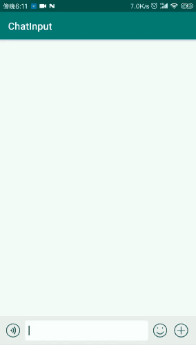

## ChatInput 仿微信输入框
效果如下  


+ 支持表情、录音、更多面板的开启和关闭 （默认全部开启） 
+ 支持自定义输入语音逻辑处理器（处理录音手势以及录音浮窗逻辑） customInputAudioProcessor 
+ 支持自定义语音录制管理器（录制语音使用 默认支持 MP3和amr格式录制）  customRecorderManager
+ 支持自定义表情面板  customEmojiFragmentFactory
+ 支持自定义更多模块面板 customMoreFragmentFactory
+ 支持@人功能   canAt
  
## 集成方式  
在根项目的build.gradle增加以下配置
```
allprojects {
    repositories {
        maven { url "https://jitpack.io" }
    }
}
```

在对应模块下的build.gradle中增加以下配置  
```
dependencies {
   implementation 'com.github.Jiaoshichun:ChatInput:1.0'
 }
```

## 使用方式  
将ChatInputView放入布局文件中 它的直接父布局必须是LinearLayout   
```
<LinearLayout
    xmlns:android="http://schemas.android.com/apk/res/android"
    android:layout_width="match_parent"
    android:layout_height="match_parent"
    android:orientation="vertical"
    >
  <android.support.v7.widget.RecyclerView
      android:id="@+id/rcview"
      android:layout_width="match_parent"
      android:layout_height="0dp"
      android:layout_weight="1"
      />
  <com.heng.chatinput.ChatInputView
      android:id="@+id/input_view"
      android:layout_width="match_parent"
      android:layout_height="wrap_content"
      />
</LinearLayout>
```
在Activity的onCreate中初始化ChatEditor  
```
  // 第一个参数是ChatInputView 第二个参数是与ChatInputView放入同一个LinearLayout 权重为1的view
  chatEditor = ChatEditor.Build(inputView, recyclerView)
        .canAt(true)
        .bindMoreModules(
            listOf(
                MoreModuleBean("拨打电话", R.mipmap.keyboard_call_normal),
                MoreModuleBean("语音聊天", R.mipmap.keyboard_call_normal)
            )
        )
        //.customEmojiFragmentFactory()  自定义 emoji 面板
        //.customInputAudioProcessor()   自定义录音手势处理器
        // .customRecorderManager()      自定义语音录制管理器
        //.customMoreFragmentFactory()   自定义更多 面板
        // .disableEmoji()               禁用 emoji
        //.disableMore()                 禁用更多模式
        //.disableVoice()                禁用语音录制
        .bindListener(this) //绑定事件回调
        .builder()

```  
目前支持的事件回调有以下几种  
```
interface ChatInputListener {
  //发送文本消息
  fun sendText(
    text: String,
    userIds: List<String>?
  )

  //输入框模式改变时的回调
  fun onChangeModel(inputModel: InputModel)

  //点击更多模块中的tab的回调
  fun onMoreModule(moreModule: MoreModuleBean)

  //发送语音
  fun sendAudio(
    file: File,
    recordTime: Long
  )
  //@人的回调
  fun toAtMember()
}
```
支持的自定义属性如下：  

|名称| 功能 |
| ------ | ------ |
| keyboard_icon | 键盘图标 | 
| emoji_icon | emoji图标 | 
| audio_icon | 语音图标 | 
| more_icon | 更多图标 | 
| edt_text_color | 输入框文字颜色 | 
| edt_max_length | 输入框文字最大长度（默认500） | 
| btn_send_bg | 发送按钮背景 | 
| btn_send_text_color | 发送文字颜色 |   

## 播放语音听筒/外放切换  
主要工具类PlayerModeManager   
  
+ 语音改变播放模式实际只存储改变后的模式状态，在真正播放时才会以设置的模式进行播放   
+ 支持获取音频焦点，播放语音时，暂停其他音乐的播放，停止时恢复其他音乐的播放    
+ 插入耳机时， 会一直以耳机模式进行播放，但是允许改变模式状态   
  
**听筒模式播放时，会先从扬声器切换到听筒再进行播放(如果在播放前转为听筒模式，会导致其他音乐也会以听筒模式播放)，建议延迟一段时间后播放，否则前几秒无音(建议延迟1.2s)**   
语音播放器的实现可参考ChatMediaPlayer  
  
最好在Application中进行初始化  
```
   //主要用于获取当前模式、设置默认的播放模式与注册耳机插拔监听器
   PlayerModeManager.init(this,true)
```  
几个重要方法   
```
    PlayerModeManager.isSpeakerOn()  //是否是扬声器模式(切换听筒/外放时，通过该方法获取之前的模式)
    PlayerModeManager.isReceiver()   //是否是听筒模式  该方法用于听筒模式播放音乐时，必须延迟一段时间（建议至少1s） 否则前几秒无声音
    PlayerModeManager.onPlay()   //播放语音时调用该方法 该方法会使其他音乐暂停，并且使用当前的播放模式进行播放
    PlayerModeManager.onStop()  //播放结束时 调用该方法 释放音频焦点 恢复外放播放
    PlayerModeManager.setSpeakerOn(true)  //设置当前是否为外放模式 
```
## 参考及引用  
[emotionkeyboard](https://github.com/shinezejian/emotionkeyboard)  
[easy_at](https://github.com/iYaoy/easy_at)
[AndPermission](https://github.com/yanzhenjie/AndPermission)  
[AndroidMP3Recorder](https://github.com/GavinCT/AndroidMP3Recorder)